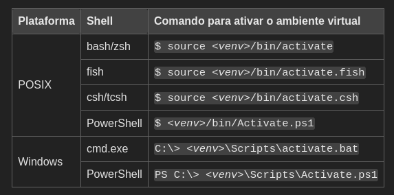

# Contador de modais terrestres

O presente projeto intenta a criação de um contador de modais terrestres com a possibilidade de inserir linhas de corte arbitrárias a partir de uma interação com interface amigável.

### Instalação e primeira execução

#### Configurando o ambiente virtual
O recomendado antes de instalar as bibliotecas de um projeto (em especial um com bibliotecas pesadas como esse) é cria um ambiente virtual do python, como se fosse uma instação do python nova mas ela seria usada somente nesse projeto.

```bash
python3 -m venv ./nome_da_env_que_voce_quer_criar
```

por exemplo:
```bash
python3 -m venv ./env_counter
```
Se ela tiver sido criada com sucesso, em seguida é necessário ativar a env, esse passo é diferente a depender do sistema operacional usado (e talvez seja necessário habilitar a execução de scripts no computador). Segue um material de referência:

https://docs.python.org/pt-br/dev/library/venv.html

Nele é apresentado a tabela abaixo:



Com isso, deve aparecer o nome da sua env criada no terminal, no inicio da linha.

#### Instalando as bibliotecas

Para instalar as bibliotecas você pode rodar o seguinte comando:
```bash
pip install -r requirements.txt
```

Assim o pip irá ler o arquivo requirements.txt presente no projeto e realizar o download das bibliotecas necessárias para executar o projeto.

#### Rodando um video com o código

Para rodar a análise de um vídeo, é necessário rodar o comando:
```bash
python main.py caminho/ate/a/pasta/com/o/video/nome_do_video.extensão
```

por exemplo:
```bash
python main.py data/cars.mp4
```

deve abrir o vídeo cars.mp4 e rodar o programa.

